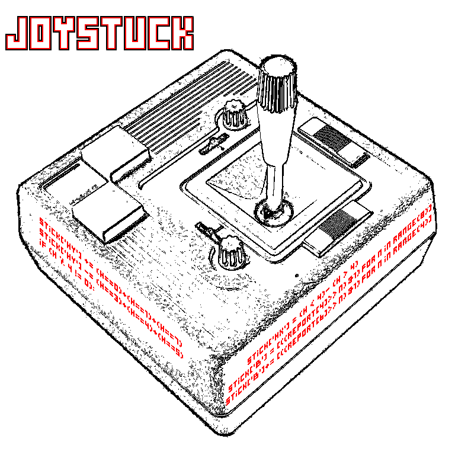

# Joystuck, v0.1
This is a Python program that reads input from a USB joystick to carry out custom functions, sounds and bindings as defined by customizable configuration files.

Currently, it is written for the Logitech Extreme3D Pro (USB vendor ID ```0x046D``` and product ID ```0xC215```). The program is extensible, and I'll accept any pull requests to add more models.

Configurations are TOML files live in ```cfg/```. The default, ```template.toml```, provides sample functions and a guide to defining your own. Multiple sound outputs can be defined for a single button, from which Joystuck will select randomly. It is also possible to define multiple toggleable soundpacks for the same configuration file.

Usage: ```joystuck.py```